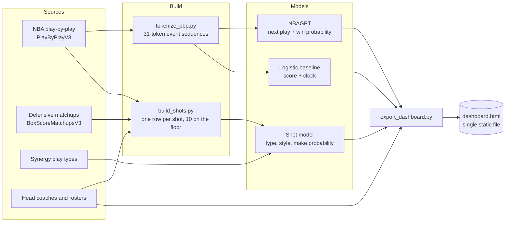

<p align="center">
  <picture>
    <source media="(prefers-color-scheme: dark)" srcset="docs/images/banner-dark.png">
    
  </picture>
</p>

<p align="center">
  
  
  
  
  
</p>

<p align="center">
  <a href="#the-dashboard"><b>Dashboard</b></a> &nbsp;&middot;&nbsp;
  <a href="#quickstart"><b>Quickstart</b></a> &nbsp;&middot;&nbsp;
  <a href="#how-it-works"><b>How it works</b></a> &nbsp;&middot;&nbsp;
  <a href="#the-models"><b>Models</b></a> &nbsp;&middot;&nbsp;
  <a href="#results"><b>Results</b></a> &nbsp;&middot;&nbsp;
  <a href="#data-and-caveats"><b>Data &amp; caveats</b></a>
</p>

<br>

**HOMERs** reads NBA games the way a scorer does, one play at a time. A transformer learns the grammar of a game from raw play-by-play, predicting the next play and the home team's win probability after every possession. A second model learns *who* takes *what* shot: every player's shot diet, and how it bends against a specific defender, a lineup, and an opposing coach's scheme.

Everything lands in a single self-contained HTML dashboard. 

<br>

<table>
  <tr>
    <td width="33%" valign="top">
      <h3>Win probability</h3>
      A decoder-only transformer over a 31-token play vocabulary, conditioned on clock, score and period. Scored against a score-and-clock logistic baseline.
    </td>
    <td width="33%" valign="top">
      <h3>Shot selection</h3>
      Eight shot types, nine shot styles and make probability for every attempt, conditioned on the shooter, all ten players on the floor, the likely defender, both head coaches and Synergy play-type profiles.
    </td>
    <td width="33%" valign="top">
      <h3>Scouting views</h3>
      Shot charts, defender indicators, coaching schemes, clickable player profiles and a fantasy leaderboard, all built from the same play-by-play.
    </td>
  </tr>
</table>

<br>

## The dashboard

<p align="center">
  
</p>

<table>
  <tr>
    <td width="50%" valign="top">
      <br>
      <b>Game replay.</b> Pick any game (filter by team) and press Watch to play it out like a broadcast: a score bug in team colors with the live score, clock and NBAGPT's win chance. A written story of the game marks the key moments, including when NBAGPT "called it". Scrub play by play, compare the model with the baseline, see its top five guesses for the next play, and copy a link to any moment (<code>#games/&lt;gameId&gt;/&lt;play&gt;</code>).
    </td>
    <td width="50%" valign="top">
      <br>
      <b>Matchup simulator.</b> Pick a shooter, a primary defender and an opposing coach. The shot model runs in the browser and returns his predicted shot mix, FG% by shot type, and expected points per shot versus an average defender and scheme.
    </td>
  </tr>
</table>

<p align="center">
  <br>
  <sub><b>Player tendencies.</b> A half-court shot chart (click a shot type to isolate it), shot mix and FG% against the league across eight shot types, nine shot styles, and Synergy play types with points per possession.</sub>
</p>

<table>
  <tr>
    <td width="50%" valign="top">
      <br>
      <b>Defender indicators.</b> How each defender changes what shooters take: rim, mid-range and three-point share, plus expected points per shot, averaged over 20,000 real attempts. Sortable, searchable, and one click loads him into the simulator.
    </td>
    <td width="50%" valign="top">
      <br>
      <b>Coaches and schemes.</b> Each head coach's offensive play-type mix, his team's shot diet, what his defense gives up, and the model's estimate of how his scheme shifts shot selection.
    </td>
  </tr>
  <tr>
    <td width="50%" valign="top">
      <br>
      <b>Player profiles.</b> Click any name in a replay for a card with bio, season averages, shooting against the league, a game-by-game fantasy chart, recent games, and live context when he's on the floor in the game you're watching.
    </td>
    <td width="50%" valign="top">
      <br>
      <b>Fantasy leaderboard.</b> Fantasy points per game with NBA.com scoring, top-five cards, and filters by season and team. Every row opens the player's profile.
    </td>
  </tr>
  <tr>
    <td width="50%" valign="top">
      <br>
      <b>Model quality.</b> Error by quarter, calibration against actual outcomes, and the training curve with the best checkpoint marked.
    </td>
    <td width="50%" valign="top">
      <br>
      <b>What-if.</b> Set a quarter, clock and lead to see the win probability, and how the same lead is worth more as time runs out.
    </td>
  </tr>
</table>

<sub>The game replay, scoreboard, model quality and what-if screenshots come from the synthetic demo data. The player, defender, coach, profile and fantasy screenshots use real NBA games.</sub>

<br>

## Quickstart

**The easy way:** `./run.sh` handles every step and picks a Python that has torch installed.

```bash
./run.sh setup       # once: install packages
./run.sh demo        # fake games -> model -> dashboard, about a minute
./run.sh status      # what's downloaded, trained, and running
./run.sh all         # the full real-data pipeline
```

Or run each step yourself:

**1. Install**

```bash
pip install -r requirements.txt
```

**2. See it working in about a minute, with no downloads**

```bash
python synthetic.py --games 400
python tokenize_pbp.py --raw data/raw_synthetic --out data/processed/synthetic.pkl
python baseline.py --data data/processed/synthetic.pkl
python train.py --data data/processed/synthetic.pkl --out runs/syn --n_layer 2 --n_embd 64 --n_head 2 --lr 1e-3
python export_dashboard.py --ckpt runs/syn/best.pt --data data/processed/synthetic.pkl
open dashboard.html
```

On a Mac you can also double-click **`Open Dashboard.command`**. It rebuilds from the real model when one exists and falls back to the demo otherwise.

**3. Go real**

```bash
python fetch_data.py                 # play-by-play, 2021-22 to 2025-26, ~6k games (a few hours, resumable)
python fetch_context.py              # coaches, Synergy play types, defensive matchups (~4 h, resumable)
python fetch_rosters.py              # names, numbers, positions, heights for profiles (~2 min)
python fetch_bbref.py                # current teams from Basketball-Reference (~2 min; --refresh during the offseason)
python tokenize_pbp.py               # -> data/processed/games.pkl
python baseline.py
python train.py --out runs/base      # 4 layers, 128-dim, ~0.8M parameters
./refresh_players.sh                 # shot table, shot model, and the dashboard export
```

Every fetcher caches each game to disk, so an interrupted run picks up where it left off.

<br>

## How it works



| Stage | Script | Output |
|---|---|---|
| Fetch play-by-play | `fetch_data.py` | `data/raw/<season>/<gameId>.parquet` |
| Fetch context | `fetch_context.py` | `data/context/coaches.parquet`, `playtypes.parquet`, `matchups/` |
| Fetch rosters | `fetch_rosters.py` | `data/context/rosters.parquet` |
| Fetch current rosters | `fetch_bbref.py` | `data/context/bbref_rosters.parquet` (Basketball-Reference) |
| Tokenize games | `tokenize_pbp.py` | `data/processed/games.pkl` |
| Baseline | `baseline.py` | `runs/baseline.joblib` |
| Train NBAGPT | `train.py` | `runs/<name>/best.pt`, `log.json` |
| Evaluate | `evaluate.py` | `results/metrics.json`, calibration and game plots |
| Scaling study | `scaling.py` | `runs/scaling/scaling.png` |
| Build shot table | `build_shots.py` | `data/processed/shots.parquet` |
| Train shot model | `shot_model.py` | `runs/shots/best.pt`, `meta.json` |
| Export dashboard | `export_dashboard.py` | `dashboard.html` |

<br>

## The models

### NBAGPT: the event transformer

Each game becomes a sequence of team-relative events such as `H_3PT_MAKE`, `A_DREB` or `H_TOV`. Offensive and defensive rebounds are inferred from who missed last; substitutions and replay reviews are dropped.

| | |
|---|---|
| Architecture | Decoder-only transformer, causal attention, tied input/output embeddings |
| Default size | 4 layers, 4 heads, 128-dim, about 0.8M parameters |
| Game state | Time remaining, score margin, period, and lead relative to time left, projected into every position so the model doesn't have to count baskets |
| Play order | Game-clock order: period, then clock, then the feed's own order. The scorer logs some plays late with high `actionNumber`s, so sorting by that number put about 1% of plays minutes out of place (17,890 plays in 4,235 of 4,919 games) |
| Heads | Next event (cross-entropy) and home win (binary cross-entropy at every position) |
| Split | The latest season is the test set, so no future games leak into training |

### The shot model

One row per field-goal attempt. The row carries the shot type (layup, dunk, floater, hook, short mid-range, long mid-range, corner 3, above-the-break 3), the style (standard, pull-up, step-back, fadeaway, driving, cutting, putback, alley-oop, running), all ten players on the floor, the likely primary defender, both head coaches and the game situation.

| | |
|---|---|
| Inputs | Learned embeddings for shooter, teammates, primary defender, the five defenders, and both coaches; standardized Synergy play-type profiles for both teams; clock, margin, period, home court |
| Structure | Two-layer MLP with three heads: shot type, shot style, and make probability given the shot type |
| Prior | Each shooter starts from his own smoothed shot history. The network learns only the shift that context adds, so every effect reads as "against this defender, this share moves by X" |
| Baselines | League-average rates, and each player's own history |
| Deployment | Weights are exported into the page and the same math runs in JavaScript. It matches PyTorch to within 0.0001 |

Lineups are rebuilt from substitutions in game-clock order, which matters because the scorer's log files some plays late. Complete five-on-five lineups are known for about 97% of shots.

<br>

## Results

HOMERs reports its numbers against baselines, including when a model doesn't beat them yet.

**Shot model, 2021-22 season** (held-out last 10% of games)

| Metric | Shot model | Player's own history | League average |
|---|---:|---:|---:|
| Shot-type log loss (lower is better) | 1.664 | **1.656** | 1.850 |
| Make probability, Brier score | 0.2306 | **0.2304** | 0.2308 |

With one season and defender data on only part of it, the context adds nothing measurable yet over a player's own history. The multi-season run with full matchup coverage is the real test.

**NBAGPT, 2024-25 season** (1,230 held-out games; trained on 2021-22 to 2023-24)

| Metric | NBAGPT | Score + clock baseline |
|---|---:|---:|
| Win-probability Brier score (lower is better) | 0.1653 | **0.1651** |
| Next-play accuracy | 40.5% | |
| Next-play perplexity | 4.65 | |

Win probability is a dead heat with the baseline: nearly everything the model knows about who wins is already in the score and the clock. The play sequence helps with the next play instead. Putting plays in game-clock order cut perplexity from 4.90 to 4.65 and raised accuracy from 40.2% to 40.5%, while the Brier score moved by 0.0003, which is noise.

<br>

## Data and caveats

- **Sources.** Play-by-play, defensive matchups, Synergy play types, coaches and rosters come from the NBA Stats API via [`nba_api`](https://github.com/swar/nba_api). Current teams and bios come from [Basketball-Reference](https://www.basketball-reference.com) team roster pages, fetched at most once every 3.5 seconds to respect its rate limit. The dashboard's Sources tab has the full list. HOMERs is not affiliated with or endorsed by the NBA.
- **Primary defender.** The NBA doesn't publish who guarded each shot. HOMERs uses the on-floor opponent who guarded the shooter most in that game, weighted by shots attempted in the matchup feed.
- **Coaches.** Each team's listed head coach for the season. Mid-season coaching changes aren't tracked.
- **Lineups.** Complete on about 97% of plays.
- **Minutes.** Checked against official 2021-22 minutes for Jokić, Giannis, Embiid and LeBron, matching to within about 0.1 minutes per game. Other players weren't checked individually.
- **Next-play odds in profiles.** They use only the model's top five guesses, so they slightly understate how involved a player is.
- **Headshots.** Profile photos are nba.com's current headshots, so a player may appear in a newer team's jersey. They don't load when the dashboard is hosted as a Claude artifact, whose security policy blocks outside images; profiles fall back to initials.
- **Current teams.** "Now" is Basketball-Reference's roster for the current season (2026-27 from August 2026), so offseason moves show up as soon as that site records them. Seven of 554 players couldn't be matched to an NBA.com ID by name and show without shot history.
- **Fantasy scoring.** NBA.com: points ×1, rebounds ×1.2, assists ×1.5, steals ×3, blocks ×3, turnovers −1.

<br>

## Project layout

```
.
├── fetch_data.py          play-by-play download (PlayByPlayV3)
├── fetch_context.py       coaches, Synergy play types, defensive matchups
├── fetch_rosters.py       roster details for profiles
├── fetch_bbref.py         current rosters from Basketball-Reference
├── synthetic.py           fake games for testing the pipeline offline
├── tokenize_pbp.py        games -> event tokens + game-state features
├── model.py               NBAGPT transformer
├── train.py               training loop with early stopping
├── baseline.py            score-and-clock logistic regression
├── evaluate.py            metrics and static plots
├── scaling.py             model size vs. validation loss
├── build_shots.py         one row per shot, lineups, defenders, coaches
├── shot_model.py          shot type / style / make model
├── export_dashboard.py    builds dashboard.html
├── export_players.py      player, defender and coach data + model weights
├── export_profiles.py     player profiles and fantasy data
├── export_shotcharts.py   shot charts for every shooter
├── export_sources.py      data sources and methods
├── export_assets.py       dashboard photos (assets/img, credits in assets/credits.json)
├── dashboard_template.html
├── refresh_players.sh     rebuild the shot model and dashboard
├── deploy.sh              rebuild and publish to Vercel
├── Open Dashboard.command double-click launcher (macOS)
└── docs/                  logo, screenshots, and banner.html (render with docs/render_banner.py)
```

<br>

## Roadmap

- Train NBAGPT on all four real seasons and publish the scaling curve
- Lineup-aware win probability and possession-level expected points
- Simulate the rest of a game by sampling future plays
- Cluster the learned player and defender embeddings into archetypes
- Extend to ten or more seasons

<br>

<p align="center">
  <picture>
    <source media="(prefers-color-scheme: dark)" srcset="docs/assets/mark-dark.svg">
    
  </picture><br>
  <sub>HOMERs · Every game is an epic.</sub>
</p>
