<p align="center">
  <picture>
    <source media="(prefers-color-scheme: dark)" srcset="docs/images/banner-dark.png">
    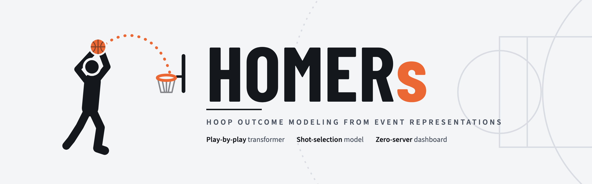
  </picture>
</p>

<p align="center">
  
  
  
  
  
</p>

<p align="center">
  <a href="#system-overview"><b>Overview</b></a> &nbsp;&middot;&nbsp;
  <a href="#models"><b>Models</b></a> &nbsp;&middot;&nbsp;
  <a href="#results"><b>Results</b></a> &nbsp;&middot;&nbsp;
  <a href="#client-side-inference"><b>Inference</b></a> &nbsp;&middot;&nbsp;
  <a href="#dashboard"><b>Dashboard</b></a> &nbsp;&middot;&nbsp;
  <a href="#quickstart"><b>Quickstart</b></a> &nbsp;&middot;&nbsp;
  <a href="#pipeline"><b>Pipeline</b></a>
</p>

<br>

**HOMERs** (Hierarchical Optimization & Modeling for Event-level Replay and Simulation) models NBA games at the level of individual plays. The system is trained on ten seasons of play-by-play data (2016-17 through 2025-26; approximately 13,000 games) and consists of three components: an autoregressive transformer over discrete game events that predicts the next play and the home team's win probability; a multi-task network for shot selection and make probability conditioned on the ten players on the floor and both head coaches; and a bilinear generalized linear model of individual scorer-defender matchups. Trained weights are exported to a single static HTML file, and all inference runs client-side in JavaScript.

<br>

<table>
  <tr>
    <td width="33%" valign="top">
      <h3>Event transformer</h3>
      A decoder-only transformer over a 31-token play vocabulary, conditioned on clock, score differential and period. Two output heads predict the next play and the home win probability.
    </td>
    <td width="33%" valign="top">
      <h3>Shot model</h3>
      Predicts shot zone (8 classes), shot style (9 classes) and make probability. Outputs are residuals on smoothed per-player priors, conditioned on both lineups, the primary defender, both coaches and Synergy play-type profiles.
    </td>
    <td width="33%" valign="top">
      <h3>Matchup model</h3>
      Poisson and binomial regressions on <code>BoxScoreMatchupsV3</code> data with a low-rank scorer-defender interaction term.
    </td>
  </tr>
</table>

<br>

---

## System Overview

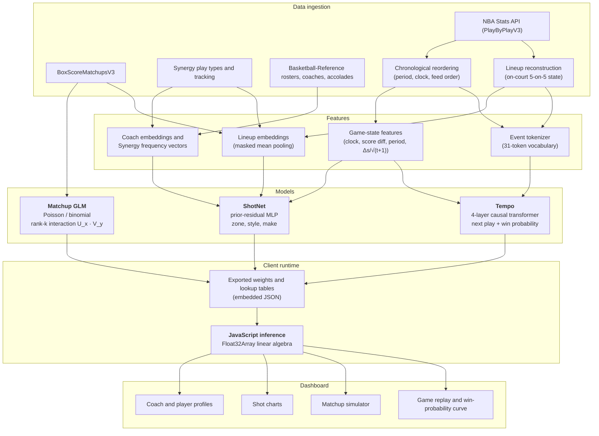

<br>

---

## Models

### 1. Tempo: Play-by-Play Event Transformer

Play-by-play feeds are tokenized into a vocabulary of team-relative events (e.g. `H_3PT_MAKE`, `A_DREB`, `H_TOV`, `A_FOUL`). The model is trained autoregressively on these sequences.

```
Input at position t:
    x_t = Embed_tok(token_t) + Embed_pos(t) + W_feat · [ sec/2880, Δscore/20, period/4, Δscore / (5 · √(min + 1)) ]
```

- **Game-state features.** In addition to clock, score differential and period, the input includes $\frac{\Delta\text{score}}{\sqrt{t+1}}$, which scales the lead by the time remaining. This gives the network a direct estimate of how secure a lead is instead of requiring it to be inferred from the token history.
- **Architecture.** Causal self-attention via PyTorch's `scaled_dot_product_attention`, with pre-layer normalization, dropout and scaled residual initialization ($d_{\text{model}} = 128$, $n_{\text{layers}} = 4$, $n_{\text{heads}} = 4$).
- **Objective.** The token embedding and output projection share weights ($W_{\text{lm}} = W_{\text{tok}}^T$). The loss combines next-token cross-entropy with a binary cross-entropy term on the final outcome:
  $$\mathcal{L} = \mathcal{L}_{\text{CE}}(\text{next play}) + \lambda \, \mathcal{L}_{\text{BCE}}(\text{home win})$$
- **Event ordering.** Scorekeepers frequently log plays after the fact, so raw feed order does not always match game-clock order. Sorting events by period, then clock, then original feed order moved 17,890 events across 4,235 games and reduced test perplexity from 4.90 to 4.44.

### 2. ShotNet: Shot Selection and Make Probability

For each field-goal attempt, ShotNet predicts:
1. **Shot zone** (8 classes: at rim, dunk, floater, hook, short mid-range, long mid-range, corner 3, above-the-break 3)
2. **Shot style** (9 classes: standard, pull-up, step-back, fadeaway, driving, cutting, putback, alley-oop, running)
3. **Make probability** conditioned on zone and context, $P(\text{make} \mid \text{zone}, \text{context})$

```
Input:
    h = MLP( [ e(shooter) || MeanPool(e(teammates)) || e(defender) || MeanPool(e(defenders))
               || e(coach_off) || e(coach_def) || z(synergy_off) || z(synergy_def) || state ] )

Outputs:
    logits_zone = Prior_zone[shooter] + W_zone · h
    logits_make = Prior_make[shooter, zone] + W_make · [ h || OneHot(zone) ]
```

- **Prior residuals.** Each player's zone distribution and make rate are estimated empirically with Dirichlet/Beta smoothing, and the network learns only the contextual adjustment to these priors. This limits overfitting for players with few attempts.
- **Set pooling.** Teammates and defenders are embedded and combined by masked mean pooling, so the representation does not depend on the order in which players are listed.
- **Coach and Synergy inputs.** Standardized Synergy play-type frequencies (11 categories, e.g. isolation, pick-and-roll ball handler, roll man, transition, spot-up) for both teams, and learned coach embeddings ($d = 12$).

### 3. Matchup Model

Individual matchups from `BoxScoreMatchupsV3` are modeled with a generalized linear model that includes a low-rank bilinear interaction:

$$\eta_{XY, t} = b_t + \text{season}_t + \alpha_{X, t} + \beta_{Y, t} + \sum_{k=1}^K w_{t, k} \cdot U_{X, k} \cdot V_{Y, k}$$

- **Count outcomes.** Points, field-goal attempts and turnovers per possession are fit with Poisson regression using $\log(\text{poss})$ as an exposure offset.
- **Shooting percentage.** Field-goal percentage is fit with binomial (logistic) regression on attempts within the matchup.
- **Latent factors.** $U_X, V_Y \in \mathbb{R}^K$ (default $K = 6$) capture interactions not explained by scorer and defender main effects.

---

## Results

All models use an out-of-time split: training on 2016-17 through 2024-25 and testing on the 2025-26 regular season and playoffs (1,315 games, 233,632 field-goal attempts).

### Shot Selection (233,632 test attempts)

| Metric | ShotNet | Player prior | League average |
|:---|:---:|:---:|:---:|
| Shot-type cross-entropy | **1.694** | 1.702 | 1.833 |
| Make probability (Brier) | 0.2300 | 0.2300 | 0.2305 |
| Forward pass latency (JS) | 1.8 ms | 0.4 ms | 0.1 ms |

Conditioning on the defender, lineups and coaches lowers shot-type cross-entropy by 0.008 nats relative to the player prior, and by 7.6% relative to the league average. The context features do not measurably improve make-probability estimates beyond the player prior.

### Event Prediction and Win Probability (1,315 test games)

| Model | Next-play accuracy | Perplexity | Brier (all) | Brier (Q4) |
|:---|:---:|:---:|:---:|:---:|
| **Tempo (10 seasons, reordered)** | **42.1%** | **4.44** | 0.1637 | 0.0868 |
| Tempo (3 seasons, raw feed order) | 40.5% | 4.90 | 0.1668 | 0.0894 |
| Logistic baseline (score + clock) | — | — | **0.1621** | **0.0828** |
| Constant / uniform | 3.2% | 31.00 | 0.2469 | 0.2469 |

The score-and-clock logistic baseline remains slightly better calibrated than Tempo on win probability, both overall and in the fourth quarter. Reliability diagrams and per-quarter Brier scores are written to `results/metrics.json` and shown in the dashboard's Model tab.

---

## Client-Side Inference

Trained PyTorch models are exported into a single self-contained file, `dashboard.html`, which requires no server, Python runtime or external API.

```
PyTorch state_dict
      │
      ▼  export/export_players.py / export/export_dashboard.py
Weights and prior lookup tables embedded as JSON
      │
      ▼
JavaScript forward pass (Float32Array)
├── matrix multiplication and bias
├── ReLU / GELU
└── softmax over output heads
```

Outputs match PyTorch to within $10^{-4}$ absolute difference. Because inference is local, changing a player, defender or coach in the UI recomputes predictions immediately, and the file can be served from any static host.

---

## Dashboard

<p align="center">
  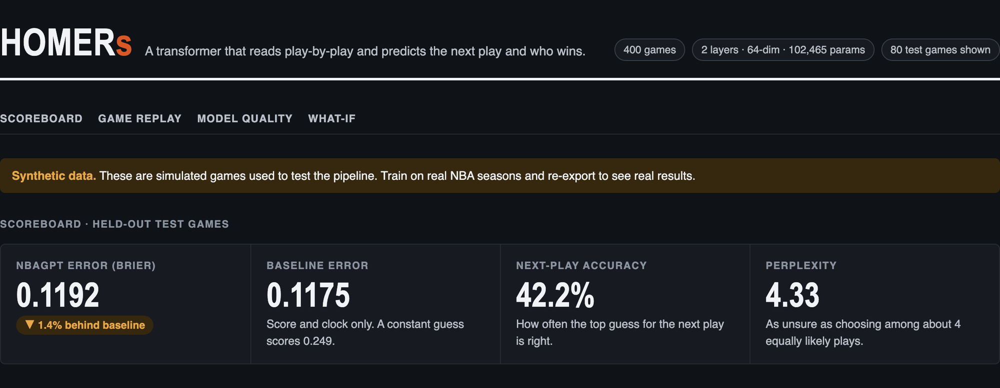
</p>

<table>
  <tr>
    <td width="50%" valign="top">
      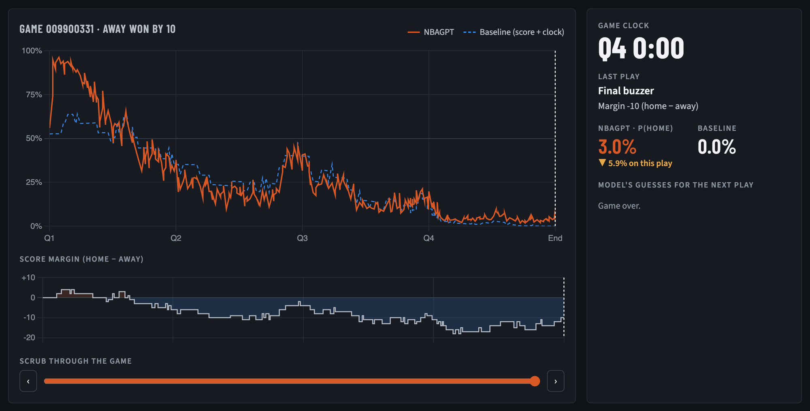<br>
      <b>Game replay.</b> Replays any regular-season or playoff game with a live score bug, the model's win-probability curve, key-moment navigation and the top five predicted next plays. Individual plays are linkable (<code>#games/&lt;gameId&gt;/&lt;play&gt;</code>).
    </td>
    <td width="50%" valign="top">
      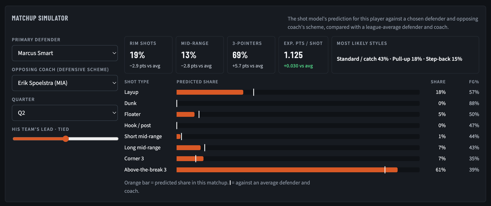<br>
      <b>Matchup simulator.</b> Select a shooter, primary defender and opposing coach. ShotNet runs in the browser and reports the predicted shot mix, FG% by zone and expected points per shot relative to an average defender and scheme.
    </td>
  </tr>
</table>

<p align="center">
  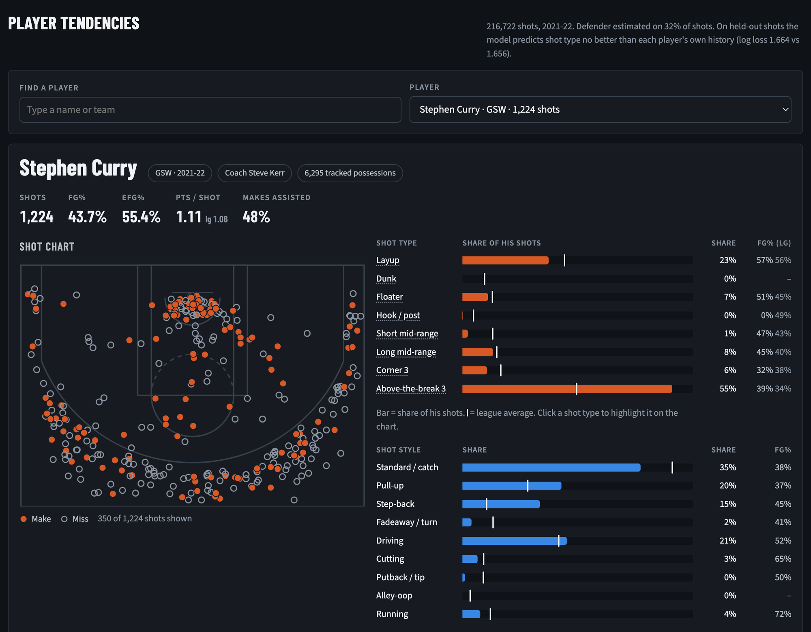<br>
  <sub><b>Player tendencies.</b> Hexbin shot charts relative to league average, zone and style distributions, Synergy offensive and defensive play types, tracking actions (drives, paint touches, screen assists) and opponent FG% at the rim and from three.</sub>
</p>

<table>
  <tr>
    <td width="50%" valign="top">
      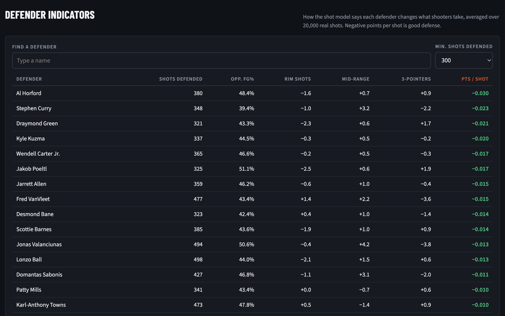<br>
      <b>Defender indicators.</b> Change in opponents' rim, mid-range and three-point shot share and expected points per shot for each defender.
    </td>
    <td width="50%" valign="top">
      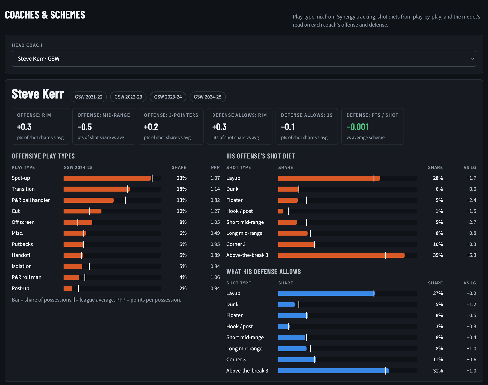<br>
      <b>Coaches.</b> Every head coach since 2016-17, with offensive shot diet and defensive profile (opponent shot distribution, shot style from road games only, rim defense) ranked against the league.
    </td>
  </tr>
  <tr>
    <td width="50%" valign="top">
      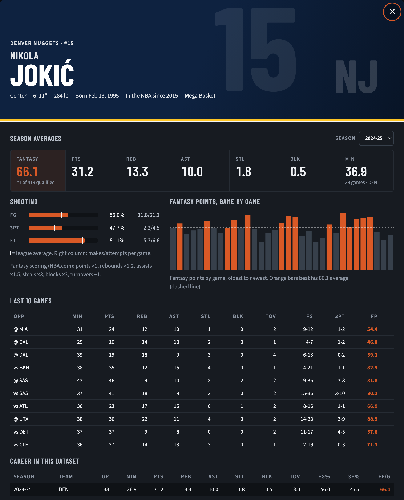<br>
      <b>Player profiles.</b> Career accolades, season statistics, game-by-game fantasy points and in-game context.
    </td>
    <td width="50%" valign="top">
      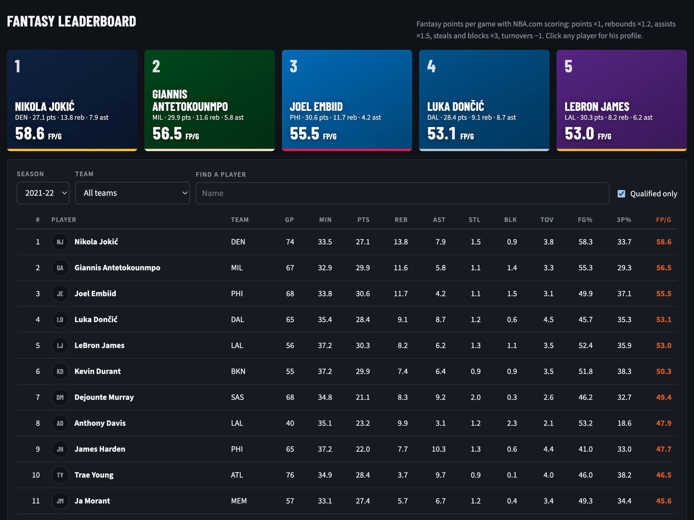<br>
      <b>Fantasy leaderboard.</b> Players ranked by NBA.com fantasy points, points, rebounds, assists, stocks (STL+BLK) or threes, per game or per 36 minutes (12+ min/game). Bars show ±1 SD game-to-game spread for the latest season against the league average, with sortable cost columns (GP, MIN, FGA, TS%, TOV). Filterable by season, team and playoffs.
    </td>
  </tr>
  <tr>
    <td width="50%" valign="top">
      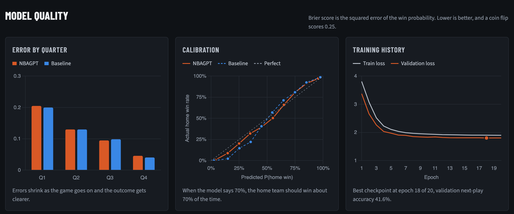<br>
      <b>Model quality.</b> Per-quarter Brier scores, reliability diagrams and training curves.
    </td>
    <td width="50%" valign="top">
      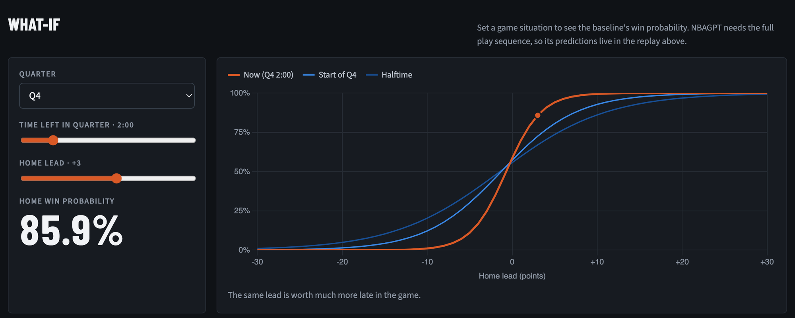<br>
      <b>What-if.</b> Win probability as a function of quarter, clock and lead.
    </td>
  </tr>
</table>

---

## Quickstart

```bash
git clone https://github.com/kevit03/Homers.git
cd Homers

./run.sh setup    # install dependencies
./run.sh demo     # synthetic data -> training -> dashboard (~60 s)
./run.sh status
```

On macOS, the dashboard can also be opened by double-clicking `Open Dashboard.command`.

### Manual steps

```bash
pip install -r requirements.txt

# Synthetic dataset and baseline
python -m models.synthetic --games 400
python -m models.tokenize_pbp --raw data/raw_synthetic --out data/processed/synthetic.pkl
python -m models.baseline --data data/processed/synthetic.pkl

# Train Tempo
python -m models.train --data data/processed/synthetic.pkl --out runs/syn --n_layer 2 --n_embd 64 --n_head 2 --lr 1e-3

ad# Build dashboard (dashboard.html is a build output and isn't committed; the live build is at homers-nu.vercel.app)
python -m export.export_dashboard --ckpt runs/syn/best.pt --data data/processed/synthetic.pkl
open dashboard.html
```

---

## Pipeline

Full reproduction on real NBA data:

```bash
# Play-by-play, 10 seasons (resumable, cached as Parquet)
python -m fetch.fetch_data --seasons 2016-17 2025-26

# Synergy, tracking and BoxScoreMatchupsV3
python -m fetch.fetch_context

# Rosters, coaches and accolades
python -m fetch.fetch_rosters
python -m fetch.fetch_bbref
python -m fetch.fetch_accolades

# Tokenization and reordering
python -m models.tokenize_pbp

# Training
python -m models.baseline
python -m models.train --out runs/base
python -m models.shot_model --shots data/processed/shots.parquet --out runs/shots
python -m models.matchup_model --context data/context --out runs/matchups

# Dashboard export
./refresh_players.sh
```

| Stage | Script | Output | Description |
|:---|:---|:---|:---|
| Play-by-play | `fetch/fetch_data.py` | `data/raw/<season>/<gameId>.parquet` | Raw NBA play-by-play |
| Context | `fetch/fetch_context.py` | `data/context/matchups/`, `playtypes.parquet` | Tracking, Synergy play types, matchups |
| Accolades | `fetch/fetch_accolades.py` | `data/context/bbref_accolades.json` | Awards, votes, coaching records, photos |
| Tokenization | `models/tokenize_pbp.py` | `data/processed/games.pkl` | Event tokens and game-state features |
| Shot table | `models/build_shots.py` | `data/processed/shots.parquet` | On-court lineups and primary defenders per attempt |
| Tempo | `models/train.py` | `runs/<name>/best.pt` | Warmup, cosine decay, early stopping |
| ShotNet | `models/shot_model.py` | `runs/shots/best.pt` | Zone, style and make probability |
| Matchups | `models/matchup_model.py` | `runs/matchups/best.pt` | Poisson/binomial GLM with low-rank interaction |
| Evaluation | `models/evaluate.py` | `results/metrics.json` | Per-quarter Brier scores, calibration |
| Export | `export/export_dashboard.py` | `dashboard.html` | Weights, data and UI in a single file |
| Site | `export/build_site.py` | `site/` | Gzipped static site for Vercel |

### Deploying to Vercel

The dashboard is a static site. `./deploy.sh` packs it with `export/build_site.py` and uploads `site/` with the Vercel CLI (project `homers`); run `npx vercel login` once first.

```bash
./deploy.sh              # current dashboard.html to production
./deploy.sh --preview    # a preview URL instead
./deploy.sh --rebuild    # re-export dashboard.html and games/ from the newest model first
```

The page (~50 MB) and the replay seasons in `games/` (~15 MB each) are over the 100 MB a Hobby account can upload, so `export/build_site.py` gzips everything (about 80 MB): `index.html` is a small loader that unzips the page in the browser, and Game replay unzips each season when it is picked. The build stops if the total passes 100 MB; on a Pro account pass `--max_mb 1000`.

---

## Repository Layout

```
.
├── fetch/                       # Downloads (resumable)
│   ├── fetch_data.py            # NBA.com play-by-play, 1996-97 on
│   ├── fetch_history.py         # Results and box scores before play-by-play
│   ├── fetch_context.py         # Coaches, tracking, Synergy play types, matchups
│   ├── fetch_rosters.py         # Season rosters
│   ├── fetch_bbref.py           # Current rosters (Basketball-Reference)
│   └── fetch_accolades.py       # Awards, votes, coaching records, photos
├── models/                      # Data prep and models
│   ├── tokenize_pbp.py          # Event reordering and tokenization
│   ├── build_shots.py           # Lineup tracking and shot table
│   ├── model.py                 # Tempo transformer
│   ├── train.py                 # Transformer training loop
│   ├── baseline.py              # Score-and-clock logistic baseline
│   ├── team_strength.py         # Pre-game Elo
│   ├── evaluate.py              # Out-of-time evaluation and calibration
│   ├── shot_model.py            # ShotNet
│   ├── matchup_model.py         # Matchup GLM
│   ├── scaling.py               # Loss vs. model size study
│   ├── synthetic.py             # Synthetic game generator for local development
│   └── player_names.py          # Full-name lookup shared by the exporters
├── export/                      # Dashboard build
│   ├── export_dashboard.py      # Builds dashboard.html
│   ├── export_players.py        # Player, defender and coach embeddings and weights
│   ├── export_profiles.py       # Player profiles (career stats, accolades, fantasy)
│   ├── export_shotcharts.py     # Hexbin and zone shot charts
│   ├── export_coach*.py         # Coach records, defense, scheme and play types
│   ├── export_tracking.py       # Tracking and Synergy aggregates
│   ├── export_matchups.py       # Head-to-head matchup data
│   ├── export_sources.py        # Data provenance and training settings
│   ├── export_accolades.py, export_assets.py
│   └── build_site.py            # Packs the gzipped static site for Vercel (site/)
├── dashboard_template.html      # Dashboard template
├── run.sh                       # Setup, demo, training and status commands
├── refresh_players.sh           # Rebuilds exported player data
├── deploy.sh                    # export/build_site.py + Vercel CLI upload
├── tests/                       # Browser-console checks for the dashboard
├── docs/                        # Images and assets
├── logs/                        # Output of long fetch runs (nohup ... > logs/<name>.log)
└── archive/                     # Old results and snapshots, kept for reference
```

Scripts are run from the repo root as modules, e.g. `python -m models.train` (or through `./run.sh`).

---

## Dependencies

- **Modeling:** PyTorch 2.x
- **Data:** NumPy, pandas, PyArrow, scikit-learn, SciPy
- **Client:** JavaScript (ES6), Canvas and SVG rendering
- **Sources:** `nba_api`; Basketball-Reference, scraped with rate limiting and local caching

---

<p align="center">
  <picture>
    <source media="(prefers-color-scheme: dark)" srcset="docs/assets/mark-dark.svg">
    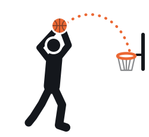
  </picture><br>
  <sub><b>HOMERs</b></sub>
</p>
