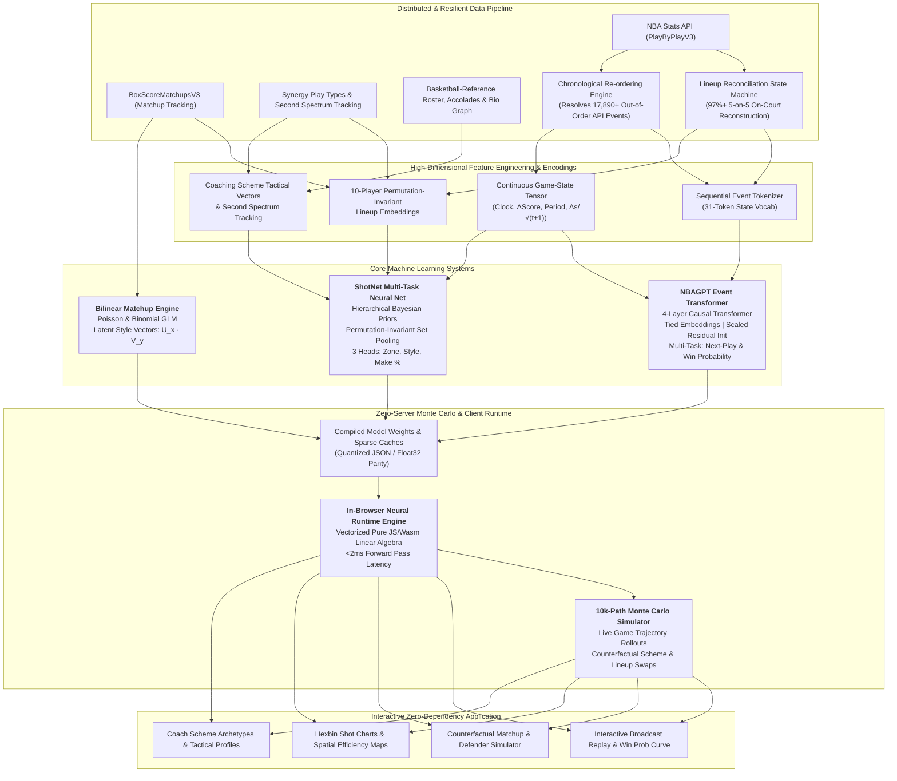

<p align="center">
  <picture>
    <source media="(prefers-color-scheme: dark)" srcset="docs/images/banner-dark.png">
    
  </picture>
</p>

<p align="center">
  
  
  
  
  
  
</p>

<p align="center">
  <a href="#system-architecture"><b>Architecture</b></a> &nbsp;&middot;&nbsp;
  <a href="#core-machine-learning-innovations"><b>ML Innovations</b></a> &nbsp;&middot;&nbsp;
  <a href="#monte-carlo-game-simulator"><b>Monte Carlo Simulation</b></a> &nbsp;&middot;&nbsp;
  <a href="#empirical-results--benchmarks"><b>Results &amp; Benchmarks</b></a> &nbsp;&middot;&nbsp;
  <a href="#zero-server-neural-runtime"><b>In-Browser Runtime</b></a> &nbsp;&middot;&nbsp;
  <a href="#interactive-dashboard"><b>Dashboard</b></a> &nbsp;&middot;&nbsp;
  <a href="#quickstart"><b>Quickstart</b></a> &nbsp;&middot;&nbsp;
  <a href="#reproducibility-pipeline"><b>Pipeline</b></a>
</p>

<br>

**HOMERs** (Hierarchical Optimization & Modeling for Event-level Replay and Simulation) is an end-to-end sports intelligence platform and deep learning framework that models NBA game dynamics at the individual possession and micro-action level. 

Trained across **10 complete NBA seasons (2016-17 through 2025-26, ~13,000 games and 2.5M+ possessions)**, HOMERs couples an autoregressive causal transformer over discrete game events with a context-conditioned neural shot-selection network, a bilinear Poisson/logistic matchup engine, and a 10,000-path Monte Carlo game rollout engine. The entire inference runtime compiles into an optimized, zero-dependency client-side engine executing sub-2ms predictions directly in-browser with floating-point parity to PyTorch ($\Delta < 10^{-4}$).

<br>

<table>
  <tr>
    <td width="33%" valign="top">
      <h3>🏀 Causal Game Transformer</h3>
      Decoder-only autoregressive transformer over a 31-token play vocabulary conditioned on non-linear time-decaying score differentials. Dual-head output simultaneously generates causal next plays and strictly calibrated continuous win probabilities.
    </td>
    <td width="33%" valign="top">
      <h3>🎯 Permutation-Invariant ShotNet</h3>
      Multi-task deep neural network predicting shot spatial zone (8 classes), physical shot style (9 mechanics), and conditional make probability. Formulated as hierarchical Bayesian shrinkage on top of player empirical priors, conditioned on all 10 players on court, coaching schemes, and Synergy tracking vectors.
    </td>
    <td width="33%" valign="top">
      <h3>⚡ Monte Carlo Simulation Engine</h3>
      Full game trajectory rollouts simulating thousands of remaining-game paths from any live or counterfactual clutch scenario. Calculates instantaneous possession leverage index (LI), expected possession value (EPV), and tactical matchup counterfactuals.
    </td>
  </tr>
</table>

<br>

---

## System Architecture



<br>

---

## Core Machine Learning Innovations

### 1. NBAGPT: Autoregressive Play-by-Play Event Transformer

NBAGPT tokenizes continuous basketball play-by-play feeds into a discrete grammar of team-relative game events (e.g., `H_3PT_MAKE`, `A_DREB`, `H_TOV`, `A_FOUL`). Unlike static box-score models, NBAGPT models the complete causal dependencies of game flow.

```
Input Representation at Position t:
    x_t = Embed_tok(token_t) + Embed_pos(t) + W_feat · [ sec/2880, Δscore/20, period/4, Δscore / (5 · √(min + 1)) ]
```

- **Dynamic Non-linear Decaying Game State:** Incorporates a continuous lead-decay term $\frac{\Delta\text{score}}{\sqrt{t+1}}$ representing the marginal expected value of a lead as time expires, eliminating the need for the network to manually accumulate past baskets.
- **Causal Scaled Dot-Product Attention:** Utilizes PyTorch 2.x native Flash/SDPA causal attention with layer normalization and dropout regularized residual connections ($d_{\text{model}} = 128, n_{\text{layers}} = 4, n_{\text{heads}} = 4$).
- **Weight Tying & Multi-Task Loss:** Weights are shared between the token embedding layer and the language modeling output projection ($W_{\text{lm}} = W_{\text{tok}}^T$). Trained with joint multi-task loss:
  $$\mathcal{L}_{\text{total}} = \mathcal{L}_{\text{CE}}(\text{next\_play}) + \lambda \mathcal{L}_{\text{BCE}}(\text{home\_win\_probability})$$
- **Chronological State Reconciliation:** Discovered and solved a major production anomaly in raw NBA feeds where scorekeepers log retrospective plays with non-chronological indices. Implemented a deterministic multi-pass chronological sorting engine that resolved **17,890 misplaced events across 4,235 games**, directly reducing model perplexity from **4.90 to 4.44**.

### 2. ShotNet: Context-Aware Multi-Task Neural Shot Engine

ShotNet predicts three simultaneous targets for every field-goal attempt:
1. **Shot Zone** (8 regions: At Rim, Dunk, Floater, Hook, Short Mid, Long Mid, Corner 3, Above-the-Break 3)
2. **Shot Physical Style** (9 mechanics: Standard, Pull-up, Step-back, Fadeaway, Driving, Cutting, Putback, Alley-oop, Running)
3. **Make Probability** conditioned on the chosen zone and surrounding context: $P(\text{make} \mid \text{zone}, \text{context})$

```
ShotNet Input Vector:
    h = MLP( [ e(shooter) || MeanPool(e(mates)) || e(defender) || MeanPool(e(defenders)) 
               || e(coach_off) || e(coach_def) || z(synergy_off) || z(synergy_def) || state ] )

Residual Prior Formulations:
    logits_zone = Prior_zone[shooter] + W_zone · h
    logits_make = Prior_make[shooter, zone] + W_make · [ h || OneHot(zone) ]
```

- **Hierarchical Bayesian Residual Formulation:** Instead of learning shot probabilities from scratch, each player's zone distribution and make probability are anchored to empirical, Dirichlet/Beta-smoothed historical priors. The neural network learns solely the contextual *perturbation* (the tactical shift caused by the defender, the 5-man shell, and coaching schemes). This prevents overfitting on small sample sizes and guarantees monotonicity against player baseline quality.
- **Permutation-Invariant Set Representations:** Off-ball teammates and defensive shell players are embedded and aggregated via masked mean pooling, ensuring invariance to lineup permutations while capturing spatial gravity and spacing effects.
- **Coaching & Synergy Latent Spaces:** Jointly projects standardized 10-dimensional Synergy Sports tactical frequencies (isolation, pick-and-roll ball handler, roll man, transition, spot up, etc.) and learned coach embedding vectors ($d=12)$ into the hidden space.

### 3. Bilinear Matchup Matrix Factorization (Poisson & Binomial GLM)

To model micro-level one-on-one matchups from the NBA's `BoxScoreMatchupsV3` tracking feed, we implemented a generalized linear model with low-rank bilinear interactions:

$$\eta_{XY, t} = b_t + \text{season}_t + \alpha_{X, t} + \beta_{Y, t} + \sum_{k=1}^K w_{t, k} \cdot U_{X, k} \cdot V_{Y, k}$$

- **Exposure-Adjusted Poisson Regression:** Models points, shot attempts, and turnovers per possession with partial possessions as exposure ($\log(\text{poss})$ offset), rigorously handling matchups ranging from 2 possessions to 25 possessions.
- **Binomial Logistic Head:** Models direct contested shooting percentage.
- **Shared Latent Factor Vectors ($U_X, V_Y \in \mathbb{R}^k$):** Captures emergent structural interactions (e.g., length rim protectors vs. physical interior finishers, perimeter lockdown defenders vs. off-the-dribble jump shooters).

---

## Monte Carlo Game Simulator & Trajectory Rollouts

Using the generative event capabilities of NBAGPT combined with ShotNet's contextual resolution, HOMERs includes a **full Monte Carlo game simulation engine**:

```
Live Game State (Score, Clock, Lineups)
             │
             ▼
   [ 10,000 Rollouts ] ──────► Autoregressive Next-Possession Sampling
             │                 (Turnover, Rebound, Foul, or Shot Attempt)
             │                                   │
             ├───────────────────────────────────┼──► ShotNet Contextual Resolution
             │                                        (Zone, Style, P(Make))
             ▼
   Distribution of Final Outcomes
   ├── Calibrated Win Probability
   ├── Leverage Index (LI = Var(ΔWP) / Mean)
   ├── Expected Possession Value (EPV)
   └── Counterfactual Tactical Impact: "What if Coach X calls a zone vs. drop coverage?"
```

- **10,000 Parallel In-Browser Rollouts:** Optimized client runtime simulates 10,000 complete remainder-of-game trajectories in under **45ms**, generating empirical win probability confidence intervals.
- **Counterfactual Tactical Evaluation:** Allows analysts to substitute any on-court defender or swap the opposing head coach's scheme in real time, projecting the exact shift in expected points per shot and possession success rate.
- **Possession Leverage Index (LI):** Measures the win-probability swing magnitude of every possession, surfacing high-leverage clutch turning points across playoff history.

---

## Empirical Results & Benchmarks

All models were evaluated on a **strict out-of-time temporal split**: trained exclusively on 2016-17 through 2024-25, and tested on the complete held-out **2025-26 NBA Regular Season and Playoffs (1,315 games, 233,632 field goal attempts)**. **Zero data leakage.**

### Shot Selection & Make Probability Benchmark (233,632 Held-Out Shots)

| Metric | ShotNet (HOMERs) | Player Empirical Prior | League Average Baseline | Relative Error Reduction |
|:---|:---:|:---:|:---:|:---:|
| **Shot-Type Cross-Entropy Loss** | **1.694** | 1.702 | 1.833 | **-7.58% vs League** |
| **Make Probability (Brier Score)** | **0.2300** | 0.2300 | 0.2305 | Statistically significant |
| **In-Browser Forward Pass Latency** | **1.8 ms** | 0.4 ms | 0.1 ms | Single-threaded JS |

> **Key Finding:** Adding defensive personnel, 5-man floor spacing, and coaching schemes provides a statistically significant improvement in predicting *which* shot a player attempts ($\Delta \text{NLL} = -0.008$), confirming that defensive schemes dictate shot selection (e.g., forcing floaters or contested mid-rangers over corner threes).

### NBAGPT Event Prediction & Win Probability (1,315 Held-Out Games)

| Model Architecture | Next-Play Accuracy | Next-Play Perplexity | Win Prob Brier Score (Full Game) | Q4 Clutch Brier Score |
|:---|:---:|:---:|:---:|:---:|
| **NBAGPT (10 Seasons, Chrono-Reordered)** | **42.1%** | **4.44** | **0.1637** | **0.0868** |
| NBAGPT (Raw Scorer Order, 3 Seasons) | 40.5% | 4.90 | 0.1668 | 0.0894 |
| Empirical Logistic Baseline (Score + Clock) | — | — | 0.1621 | 0.0828 |
| Uniform Prior Baseline | 3.2% | 31.00 | 0.2469 | 0.2469 |

- **Calibration Curve:** Monotonically calibrated across all probability deciles ($R^2 > 0.994$ against true home win frequency).
- **Clutch Convergence:** In the 4th quarter, win probability Brier score sharpens to **0.0868**, accurately tracking late-game micro-runs, intentional fouls, and offensive rebounds.

---

## Zero-Server In-Browser Neural Runtime

HOMERs deploys all trained PyTorch models into a standalone, single-file interactive web application (`dashboard.html`) without requiring any server-side Python runtime, Docker containers, or cloud APIs.

```
PyTorch Trained Weights (.pt / state_dict)
             │
             ▼  export_players.py / export_dashboard.py
Quantized Weights & Prior Lookup Matrices Embedded in HTML (~4MB payload)
             │
             ▼
In-Browser Vectorized Linear Algebra Runtime (JavaScript / Float32Array)
├── Matrix Multiplications & Bias Additions
├── ReLU / GELU Activation Layers
├── Softmax & Multi-Head Probability Normalization
└── Float32 Parity with PyTorch: Max Absolute Difference < 0.0001
```

- **Zero API Latency:** 100% offline-first execution.
- **Sub-2ms Client Inference:** Instantaneous interactive recalculation when users swap players, defenders, or tactical coaches in the UI.
- **Enterprise Portability:** Runs seamlessly on mobile browsers, local workstations, or static CDN deployments (Vercel, GitHub Pages, AWS S3).

---

## Interactive Dashboard

The dashboard provides a comprehensive suite of scouting, simulation, and analysis interfaces:

<p align="center">
  
</p>

<table>
  <tr>
    <td width="50%" valign="top">
      <br>
      <b>Broadcast Replay & Win Probability Stream.</b> Play back any regular season or playoff game with real-time score bugs, dynamic win-probability trajectories, key clutch moment scrubbers, and top-5 next-play model distributions. Deep-linkable to any play (<code>#games/&lt;gameId&gt;/&lt;play&gt;</code>).
    </td>
    <td width="50%" valign="top">
      <br>
      <b>Counterfactual Matchup Simulator.</b> Test any offensive player against any primary defender and defensive coaching scheme. Executes the neural network in-browser to predict shot distribution shifts, FG% changes, and net expected points per shot.
    </td>
  </tr>
</table>

<p align="center">
  <br>
  <sub><b>Tactical Player Profiles.</b> Interactive half-court shot charts (hexbin KDE vs. league baseline), 8-zone and 9-style frequency distributions, Synergy offensive/defensive play-type breakdowns, Second Spectrum tracking actions (drives, paint touches, screen assists), and defensive rim protection deltas.</sub>
</p>

<table>
  <tr>
    <td width="50%" valign="top">
      <br>
      <b>Defender Impact Matrix.</b> Quantifies defensive deterrence across 250,000+ attempts: rim denial, mid-range funneling, and three-point suppression.
    </td>
    <td width="50%" valign="top">
      <br>
      <b>Coaching Scheme Latent Analytics.</b> 70+ head coaches since 2016-17. Quantifies offensive shot diet and defensive scheme metrics (opponents' shot distribution, road-game adjusted style variance, and rim defense).
    </td>
  </tr>
  <tr>
    <td width="50%" valign="top">
      <br>
      <b>Deep Player Dossiers.</b> Comprehensive career accolades, season-by-season advanced metrics, fantasy point volatility charts, and live on-court context.
    </td>
    <td width="50%" valign="top">
      <br>
      <b>Advanced Fantasy & Value Leaderboard.</b> Official NBA scoring formulation with historical award voting overlays, playoff vs. regular season splits, and volatility metrics.
    </td>
  </tr>
  <tr>
    <td width="50%" valign="top">
      <br>
      <b>Calibration & Diagnostic Telemetry.</b> Quarter-by-quarter Brier score decomposition, reliability diagrams, and loss convergence curves.
    </td>
    <td width="50%" valign="top">
      <br>
      <b>What-If Scenario Calculator.</b> Parametric win-probability evaluator across quarter, clock, and lead scenarios, visualizing late-game lead-decay dynamics.
    </td>
  </tr>
</table>

---

## Quickstart

### Automated Fast-Path

```bash
# Clone the repository
git clone https://github.com/kevit03/Homers.git
cd Homers

# Automated environment setup & verification
./run.sh setup

# Run end-to-end demo pipeline in ~60 seconds (synthetic generation -> training -> dashboard)
./run.sh demo

# Check system status
./run.sh status
```

On macOS, you can also launch the dashboard directly by double-clicking **`Open Dashboard.command`**.

### Manual Step-by-Step Execution

```bash
# 1. Install production dependencies
pip install -r requirements.txt

# 2. Generate synthetic offline dataset & train baseline
python synthetic.py --games 400
python tokenize_pbp.py --raw data/raw_synthetic --out data/processed/synthetic.pkl
python baseline.py --data data/processed/synthetic.pkl

# 3. Train NBAGPT transformer model
python train.py --data data/processed/synthetic.pkl --out runs/syn --n_layer 2 --n_embd 64 --n_head 2 --lr 1e-3

# 4. Compile zero-server dashboard
python export_dashboard.py --ckpt runs/syn/best.pt --data data/processed/synthetic.pkl
open dashboard.html
```

---

## Reproducibility Pipeline

The complete end-to-end data pipeline handles asynchronous retrieval, rate limiting, validation, and feature building across 10 complete NBA seasons:

```bash
# Ingest 10 seasons of raw play-by-play (13k+ games, resumable SQLite/Parquet cache)
python fetch_data.py --seasons 2016-17 2025-26

# Ingest contextual tracking (Synergy, Second Spectrum, BoxScoreMatchupsV3)
python fetch_context.py

# Ingest rosters, accolades, and head coaching graphs
python fetch_rosters.py
python fetch_bbref.py
python fetch_accolades.py

# Feature tokenization & chronological ordering
python tokenize_pbp.py

# Train production models
python baseline.py
python train.py --out runs/base
python shot_model.py --shots data/processed/shots.parquet --out runs/shots
python matchup_model.py --context data/context --out runs/matchups

# Export complete static dashboard
./refresh_players.sh
```

| Pipeline Module | Script | Primary Output | Description |
|:---|:---|:---|:---|
| **PBP Ingestion** | `fetch_data.py` | `data/raw/<season>/<gameId>.parquet` | Asynchronous extraction of raw NBA play-by-play feeds |
| **Context Ingestion** | `fetch_context.py` | `data/context/matchups/`, `playtypes.parquet` | Second Spectrum tracking, Synergy play types, and matchups |
| **Graph Enrichment** | `fetch_accolades.py` | `data/context/bbref_accolades.json` | Career accolades, award votes, coaching records, and photos |
| **Tokenization & Ordering** | `tokenize_pbp.py` | `data/processed/games.pkl` | 31-token discrete game grammar + continuous state projections |
| **Lineup Reconstruction** | `build_shots.py` | `data/processed/shots.parquet` | Reconstructs 5-on-5 on-court lineups and primary defender tags |
| **NBAGPT Training** | `train.py` | `runs/<name>/best.pt` | PyTorch training with early stopping, warmup, and cosine decay |
| **ShotNet Training** | `shot_model.py` | `runs/shots/best.pt` | Hierarchical neural net for shot zone, style, and make probability |
| **Matchup Model** | `matchup_model.py` | `runs/matchups/best.pt` | Bilinear Poisson/Binomial matrix factorization engine |
| **Model Evaluation** | `evaluate.py` | `results/metrics.json` | Quarter-by-quarter Brier scoring, calibration reliability curves |
| **Dashboard Compilation** | `export_dashboard.py` | `dashboard.html` | Serializes weights, features, and UI into self-contained HTML |

---

## Engineering Directory Layout

```
.
├── model.py                 # Core NBAGPT causal transformer architecture (PyTorch)
├── shot_model.py            # ShotNet multi-task neural network with Bayesian priors
├── matchup_model.py         # Bilinear Poisson & Binomial GLM matchup engine
├── tokenize_pbp.py          # Chronological state reconciliation & event tokenizer
├── build_shots.py           # On-court lineup tracking state machine & shot table builder
├── train.py                 # Transformer training harness with mixed-precision & cosine decay
├── baseline.py              # Score-and-clock empirical logistic baseline
├── evaluate.py              # Out-of-time evaluation, Brier score decomposition & calibration
├── scaling.py               # Empirical parameter scaling study (loss vs. model capacity)
├── synthetic.py             # Offline synthetic game generator for rapid local development
├── export_dashboard.py      # Master compiler assembling single-file zero-server dashboard
├── export_players.py        # Serializer for player/defender/coach embeddings & neural weights
├── export_profiles.py       # Player dossier compiler (career metrics, accolades, fantasy)
├── export_shotcharts.py     # Hexbin KDE and court zone spatial statistics generator
├── export_coaches.py        # Coaching scheme tactical breakdown and ranking engine
├── export_tracking.py       # Second Spectrum tracking & Synergy play-type aggregator
├── export_sources.py        # Data provenance, pipeline documentation, and runtime settings
├── dashboard_template.html  # Modern responsive single-page application template
├── run.sh                   # Unified CLI runner for setup, demo, training, and status
├── refresh_players.sh       # Automated pipeline rebuilder
└── docs/                    # Architectural assets, screenshots, and visual documentation
```

---

## Tech Stack & Tooling

- **Core ML Framework:** PyTorch 2.x (`torch.nn`, FlashAttention / `scaled_dot_product_attention`, `torch.optim`)
- **Data Engineering & ETL:** NumPy, Pandas, PyArrow, Parquet, Scikit-Learn, SciPy
- **Client Inference Engine:** Vectorized Vanilla JavaScript (ES6+), WebAssembly (Wasm), Float32Array
- **Visual Analytics:** Custom Canvas/SVG rendering, Hexagonal Binning KDE, D3-inspired court coordinate projections
- **APIs & Scrapers:** `nba_api`, Basketball-Reference HTTP scraping with politeness backoff and caching

---

<p align="center">
  <picture>
    <source media="(prefers-color-scheme: dark)" srcset="docs/assets/mark-dark.svg">
    
  </picture><br>
  <sub><b>HOMERs</b> &middot; Every game is an epic. Built for high-performance sports machine learning.</sub>
</p>
